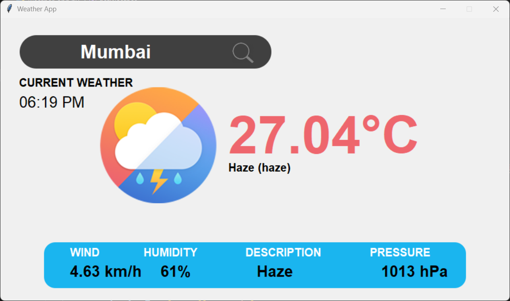
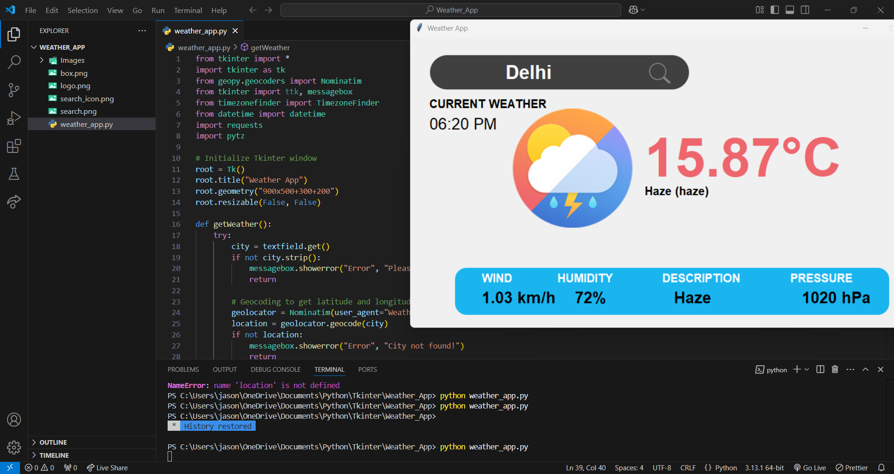

# Weather App 🌤️🌧️
A simple and interactive weather application built using Python and Tkinter. This app allows users to get real-time weather information based on any city they input. It fetches weather data such as temperature, humidity, wind speed, pressure, and a weather description from OpenWeather's API.  

# Features 🌟  
🌍 Real-time weather updates: Get current weather details for any city.  
🕰️ Location-based time: Displays local time based on the city's geographical location.  
🖥️ User-friendly interface: Easy-to-use design with a neat and simple GUI.  
🌬️ Weather details: Provides wind speed, humidity, pressure, and weather descriptions.  
🌡️ Temperature conversion: Displays temperature in Celsius (can be modified for other units).   

# Technologies Used ⚙️  
- Python    
- Tkinter (GUI Framework) 🖥️  
- OpenWeather API (for fetching weather data) 🌦️  
- Geopy & TimezoneFinder (for location-based features) 🌍  

# Prerequisites 📋  
Before running the Weather App, ensure you have the following installed on your system:  
- Python 3.x  
- Tkinter: Python GUI framework  
- requests: For making API calls to fetch weather data.  
- geopy: For getting geographic coordinates.  
- pytz: For time zone conversion.  
- timezonefinder: To find time zone based on latitude and longitude.

You can install the required libraries using pip:  
pip install requests geopy pytz timezonefinder  

# How to Use 🛠️
1. Clone the repository to your local machine:  
   git clone https://github.com/your-username/weather-app.git  
2. Navigate into the project directory:  
   cd weather-app  
3. Run the Python script:
   python weather_app.py  
4. Enter a city name in the search box.  
5. Click the search button to fetch weather details.  
6. View the weather conditions such as temperature, wind speed, humidity, and more.  
7. The local time of the city will also be displayed.

# API Key 🔑  
To make the app work, you need an API key from OpenWeather. You can get it by signing up on their website: OpenWeather API.  
Once you have the key, replace the "YOUR_API_KEY" placeholder in the code with your actual API key:  
api = "https://api.openweathermap.org/data/2.5/weather?q=" + city + "&appid=YOUR_API_KEY"  

# 📂 Project Structure  
This is the structure of the project folder:  
weather-app/
│
├── README.md              # Project description and instructions
├── weather_app.py         # Main Python application file (Tkinter GUI)
├── images.png             # Parts of the main window
├── images/                # Folder containing images
│   └── screenshot.png     # Example screenshots

# Screenshots 📸
Here are some screenshots of the Weather App in action:  
   
   

# 👨‍🏫 Acknowledgments
This project was created by following the tutorial from Tech With Tim - Python Weather App Tutorial.  
https://youtu.be/NCCYWIzN6hU?si=p3mAKSVmxF2-VKyf
